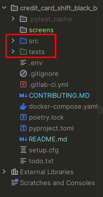

## **Запуск проекта в dev-режиме**
Инструкция ориентирована на операционную систему windows и утилиту git bash.<br/>
Для прочих инструментов используйте аналоги команд для вашего окружения.

1. Клонируйте репозиторий и перейдите в него в командной строке:

```git
git clone https://github.com/artyom-vah/black_box_testing_framework.git
```

2. Устанавливаем poetry (если оно не установлено)

```git
pip install poetry 
```
3. Проверяем версию poetry

```git
poetry -V
```
```python
# вывод:
# Poetry (version 1.6.1)
```
4. Активируем виртуальное окружение в poetry

```git
poetry init
```
5. Устанавливаем все зависимости, указанные в файле pyproject.toml.
```git
poetry install
```
6. Помечаем пакет src - как Sources root,  tests - как Test Sources root



7. Для запуска тестов выполняем по порядку запуск test_all_api.py:
```git
pytest tests/my_scenarios/test_all_api.py ```

```python
# после выполнения будет выведено:
=========================================================== test session starts ============================================================
platform win32 -- Python 3.11.5, pytest-7.4.2, pluggy-1.3.0
rootdir: D:\Programming\Python\QA_Shift\dz\credit_card_shift_black_box_testing
configfile: setup.cfg
plugins: Faker-19.11.0
collected 1 item                                                                                                                             

tests\my_scenarios\test_all_api.py .                                                                                                  [100%]

============================================================ 1 passed in 2.99s =============================================================
```
8. Запускаем 1й тестовый сценарий из требований test_one.py:

```git
pytest tests/my_scenarios/test_one.py 
```

```python
# после выполнения будет выведено:
=========================================================== test session starts ============================================================
platform win32 -- Python 3.11.5, pytest-7.4.2, pluggy-1.3.0
rootdir: D:\Programming\Python\QA_Shift\dz\credit_card_shift_black_box_testing
configfile: setup.cfg
plugins: Faker-19.11.0
collected 8 items                                                                                                                            

tests\my_scenarios\test_one.py ........                                                                                               [100%]

============================================================ 8 passed in 1.12s =============================================================
```
9. Запускаем 2й тестовый сценарий из требований test_two.py:

```git
pytest tests/my_scenarios/test_two.py 
```

```python
# после выполнения будет выведено:
=========================================================== test session starts ============================================================
platform win32 -- Python 3.11.5, pytest-7.4.2, pluggy-1.3.0
rootdir: D:\Programming\Python\QA_Shift\dz\credit_card_shift_black_box_testing
configfile: setup.cfg
plugins: Faker-19.11.0
collected 7 items                                                                                                                           

tests\my_scenarios\test_two.py .......                                                                                                [100%]

============================================================ 7 passed in 12.30s ============================================================
```
10. Запускаем 3й тестовый сценарий из требований test_three.py:

```git
pytest tests/my_scenarios/test_three.py
```

```python
# после выполнения будет выведено:
=========================================================== test session starts ============================================================
platform win32 -- Python 3.11.5, pytest-7.4.2, pluggy-1.3.0
rootdir: D:\Programming\Python\QA_Shift\dz\credit_card_shift_black_box_testing
configfile: setup.cfg
plugins: Faker-19.11.0
collected 7 items                                                                                                                           

tests\my_scenarios\test_two.py .......                                                                                                [100%]

============================================================ 7 passed in 12.30s ============================================================
```
11. Запускаем 4й тестовый сценарий из требований test_four.py:

```git
pytest tests/my_scenarios/test_four.py 
```
```python
=========================================================== test session starts ============================================================
platform win32 -- Python 3.11.5, pytest-7.4.2, pluggy-1.3.0
rootdir: D:\Programming\Python\QA_Shift\dz\credit_card_shift_black_box_testing
configfile: setup.cfg
plugins: Faker-19.11.0
collected 5 items                                                                                                                           

tests\my_scenarios\test_four.py .....                                                                                                 [100%]

============================================================ 5 passed in 11.20s ============================================================
```
12. Запускаем тест алгоритма расчета доступного кредитного лимита (Требования к БКК 11):


```git
pytest tests/my_scenarios/test_algorithm_calculating_available_credit_limit.py
```
```python
=========================================================== test session starts ============================================================
platform win32 -- Python 3.11.5, pytest-7.4.2, pluggy-1.3.0
rootdir: D:\Programming\Python\QA_Shift\dz\credit_card_shift_black_box_testing
configfile: setup.cfg
plugins: Faker-19.11.0
collected 23 items                                                                                                                          

tests\my_scenarios\test_algorithm_calculating_available_credit_limit.py ss.ss.sss.s..ssss..s.ss                                       [100%]

====================================================== 8 passed, 15 skipped in 16.30s ====================================================== 
```
 